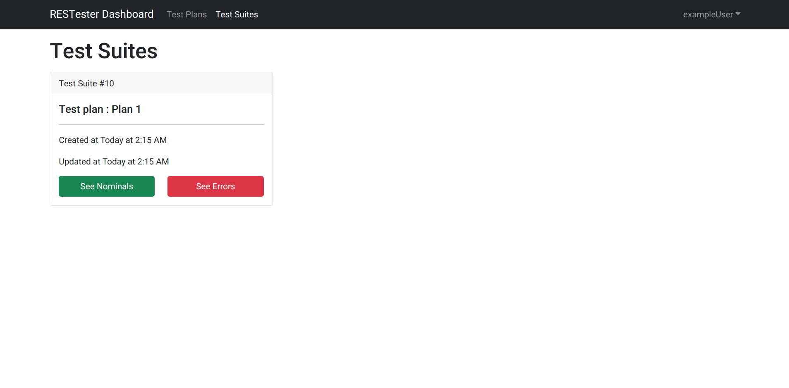

# RESTester-TaaS

Testing as a Service (TaaS) with RESTful API to integrate with [RESTester](https://github.com/mmohajer9/RESTester)

## Requirements

- Python 3.9.5+
- Django 3.2+

## Installation

### Backend Installation

1. `cd backend`
2. `pip install -r requirements.txt`
3. `python manage.py collectstatic`
4. set your environment variables in .env file

## Usage

### Backend Usage

1. `python manage.py migrate`
2. `python manage.py runserver`

### Class Diagram

### Screenshots

## Credits

Thank those who helped make this possible.
